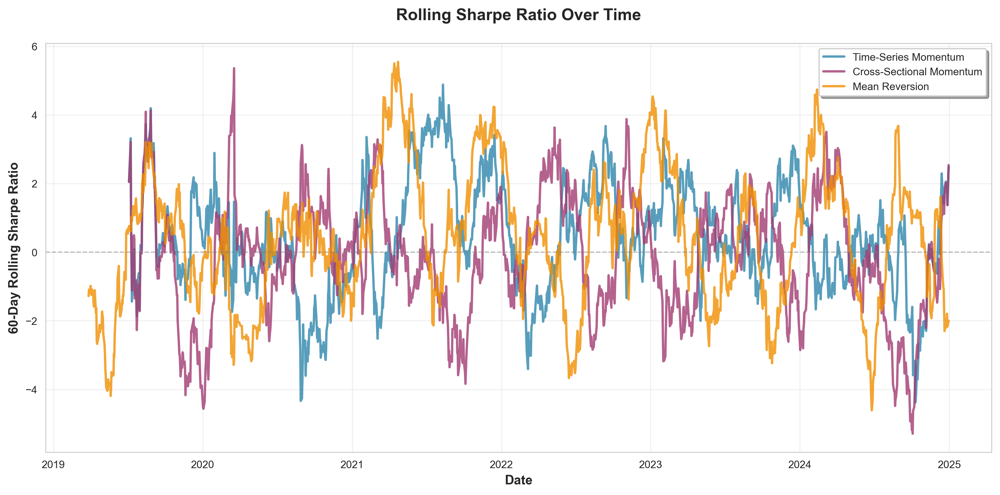
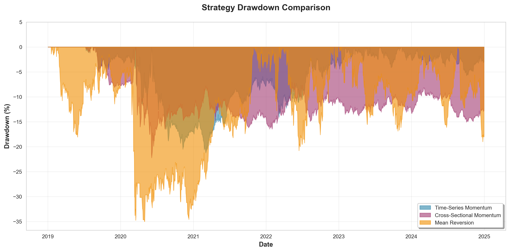

# AlphaLab: LLM-Powered Trading Strategy Generation Framework

Automated trading strategy generation using large language models with leakage aware backtesting engine.

## Table of Contents

1. [Overview](#overview)
2. [Backtesting Engine](#backtesting-engine)
3. [LLM Strategy Generation System](#llm-strategy-generation-system)
4. [Evaluation Framework](#evaluation-framework)
5. [Feature Engineering](#feature-engineering)
6. [Strategy Database and Few-Shot Learning](#strategy-database-and-few-shot-learning)
7. [Limitations and Future Work](#limitations-and-future-work)
8. [Installation and Usage](#installation-and-usage)
9. [References](#references)

---

## Overview

This project implements an end-to-end pipeline for automated trading strategy development. Main components include:

1. **Backtesting Engine**: Rigorous evaluation framework with realistic transaction costs and leakage-aware validation using [purged K-fold CV](https://en.wikipedia.org/wiki/Purged_cross-validation) (see [5]).
2. **LLM Strategy Generator**: Iterative refinement system that learns from backtest results to improve strategy quality
3. **Strategy Database**: Persistent storage enabling few-shot learning from prior attempts

**Key findings**: LLM-generated strategies currently struggle to achieve production-quality performance (target Sharpe >= 0.70), highlighting fundamental challenges in applying foundation models to quantitative finance without domain-specific alignment. 

Current limitations and proposed solutions are discussed in [Limitations and Future Work](#limitations-and-future-work).

---

## LLM Strategy Generation System

### Architecture Flowchart

The system implements an iterative refinement loop with feedback from backtest evaluations:

```
┌─────────────────────────────────────────────────────────────────────────┐
│                    STRATEGY GENERATION PIPELINE                          │
└─────────────────────────────────────────────────────────────────────────┘

                               ┌──────────────┐
                               │   START      │
                               │  Iteration i │
                               └───────┬──────┘
                                       │
                ┌──────────────────────▼─────────────────────────┐
                │  STRATEGY DATABASE (SQLite)                    │
                │  - Retrieve top 3 successful strategies        │
                │  - Retrieve 2 instructive failures             │
                │  - Extract specs, metrics, validation results  │
                └────────────────────┬───────────────────────────┘
                                     │ Few-shot examples
                                     │
                ┌────────────────────▼───────────────────────────┐
                │  DYNAMIC PROMPT CONSTRUCTION                   │
                │  ┌──────────────────────────────────────────┐  │
                │  │ Components:                              │  │
                │  │ • Available features (80+ columns)       │  │
                │  │ • Best strategy from iteration i-1       │  │
                │  │ • Worst strategy (negative example)      │  │
                │  │ • LOFO analysis results                  │  │
                │  │ • Prescriptive guidance (if struggling)  │  │
                │  │ • Weight/transform constraints           │  │
                │  │ • Few-shot examples from database        │  │
                │  └──────────────────────────────────────────┘  │
                └────────────────────┬───────────────────────────┘
                                     │
                ┌────────────────────▼────────────────────────────┐
                │  LLM GENERATION                                 │
                │  Models: GPT-4o-mini, GPT-5-mini, GPT-5-nano    │
                │  Output: 3 strategy specifications (JSON)       │
                │  Format: {"family": "cross_sectional_rank",     │
                │           "factors": [...], "transforms": [...],│
                │           "weights": [...]}                     │
                └────────────────────┬────────────────────────────┘
                                     │
                ┌────────────────────▼───────────────────────────┐
                │  SPEC COMPILATION                              │
                │  - Validate JSON schema                        │
                │  - Check weight constraints                    │
                │  - Verify column availability                  │
                │  - Compile to executable Python class          │
                └────────────────────┬───────────────────────────┘
                                     │
                ┌────────────────────▼───────────────────────────┐
                │  BACKTESTING ENGINE                            │
                │  - Run on 31 equities, 2019-2025               │
                │  - Apply transaction costs (2+5+30 bps)        │
                │  - Calculate metrics (Sharpe, DD, Win Rate)    │
                └────────────────────┬───────────────────────────┘
                                     │
                ┌────────────────────▼───────────────────────────┐
                │  EVALUATION & SCORING                          │
                │  Score = 0.35xSharpe + 0.20xDD + 0.15xSortino  │
                │         + 0.10xCalmar + 0.05xWinRate           │
                │         + 0.10xConsistency + 0.05xTailRisk     │
                │  Pass threshold: Score >= 50/100               │
                └────────────────────┬───────────────────────────┘
                                     │
                ┌────────────────────▼───────────────────────────┐
                │  LOFO ABLATION ANALYSIS                        │
                │  (Leave-One-Factor-Out)                        │
                │  For best strategy:                            │
                │    For each factor f:                          │
                │      - Remove f from spec                      │
                │      - Re-backtest modified strategy           │
                │      - Measure Delta Sharpe, Delta Drawdown    │
                │      - Classify: HELPS vs HURTS                │
                └────────────────────┬───────────────────────────┘
                                     │
                ┌────────────────────▼───────────────────────────┐
                │  STRATEGY DATABASE UPDATE                      │
                │  - Store all 3 strategies (specs + metrics)    │
                │  - Record validation pass/fail                 │
                │  - Save LOFO results for best strategy         │
                │  - Update global best tracker                  │
                └────────────────────┬───────────────────────────┘
                                     │
                              ┌──────▼──────────┐
                              │ Stopping check: │
                              │ 1. Score >= 50?  │
                              │ 2. Max iter?    │
                              │ 3. Early stop?  │
                              └──┬───────────┬──┘
                                 │           │
                           YES───┘           └───NO
                            │                    │
                    ┌───────▼──────┐             │
                    │   SUCCESS    │             │
                    │ Return best  │             │
                    │   strategy   │             │
                    └──────────────┘             │
                                                 │
                                         ┌───────▼────────────────┐
                                         │ Check improvement:     │
                                         │ Delta >= min_delta?    │
                                         └───┬──────────┬─────────┘
                                             │          │
                                        YES──┘          └──NO
                                         │                  │
                                ┌────────▼────────┐  ┌──────▼──────────┐
                                │ Reset patience  │  │ patience_count++│
                                │ counter = 0     │  │                 │
                                └────────┬────────┘  └──────┬──────────┘
                                         │                  │
                                         └──────┬───────────┘
                                                │
                                        ┌───────▼────────┐
                                        │ i = i + 1      │
                                        │ Continue loop  │
                                        └───────┬────────┘
                                                │
                                                └─────────┐
                                                          │
                        ┌─────────────────────────────────┘
                        │
             ┌──────────▼─────────────────────────────────────────────────┐
             │  REFINEMENT PROMPT CONSTRUCTION (Iteration i+1)            │
             │  Best strategy spec + metrics + LOFO results + failures    │
             └────────────────────────────────────────────────────────────┘
                                        │
                                        └──────► (Loop to top)
```

### Key Components

**1. Dynamic Prompting**

Each iteration receives a contextually adapted prompt containing:
- **Performance Feedback**: Metrics from iteration i-1 (Sharpe, drawdown, win rate)
- **Best Strategy Specification**: Full JSON spec showing what worked
- **Worst Strategy**: Negative example showing what definitively failed
- **LOFO Analysis**: Identifies which factors help vs hurt performance
- **Prescriptive Guidance**: Targeted suggestions based on specific metric failures (e.g., "If Sharpe < 0.70, add supporting factor to diversify signal sources")
- **Validation Rules**: Strict constraints on weights [0.20, 0.55], transforms (exactly 2), and thesis coherence

**2. Few-Shot Learning**

The `ExampleSelector` queries the strategy database to provide:
- Top 3 high-performing strategies (Sharpe > 0.50) as positive examples
- Top 2 failed strategies with instructive failure modes as negative examples
- Domain-specific context showing realistic factor combinations and weight distributions

**3. Spec Compilation**

LLM outputs JSON specifications that are compiled to executable Python classes:

```json
{
  "family": "cross_sectional_rank",
  "factors": [
    {
      "name": "momentum",
      "expr": "ret_60d",
      "transforms": ["cs_robust_zscore", "winsor:-3,3"]
    },
    {
      "name": "volume_confirmation",
      "expr": "volume_zscore_20d",
      "transforms": ["cs_robust_zscore", "winsor:-3,3"]
    }
  ],
  "combine": {"method": "weighted_mean", "weights": [0.55, 0.45]},
  "post": ["cs_rank_pct_centered", "clip:-2,2"],
  "rationale": "Momentum with volume confirmation for robust signals"
}
```

The `FactorSpecCompiler` validates schema compliance, checks column availability, and generates strategy classes with proper transform pipelines.

**4. LOFO (Leave-One-Factor-Out) Analysis**

Ablation analysis identifies factor importance:

```
For each factor f in best_strategy:
    1. Remove factor f from specification
    2. Re-backtest modified strategy
    3. Measure Delta Sharpe, Delta Drawdown, Delta Win Rate
    4. Classify:
       - HELPS: Removing f hurts performance -> keep it
       - HURTS: Removing f improves performance -> drop it
```

LOFO results are injected into the next iteration's prompt with critical enforcement: "**If LOFO identifies harmful columns, DO NOT use those columns in new strategies.**"

**5. Early Stopping Mechanism**

To prevent wasted compute when refinement plateaus, the system implements a patience-based early stopping mechanism:

**Parameters:**
- `early_stopping_patience`: Number of iterations without improvement before stopping (default: 10)
- `early_stopping_min_delta`: Minimum score improvement threshold to reset patience (default: 0.5 points)

**Logic:**
1. After each iteration, compute improvement: `Deltascore = current_iteration_score - best_score_so_far`
2. If `Deltascore >= min_delta`: Reset `patience_counter = 0` (significant improvement found)
3. If `Deltascore < min_delta`: Increment `patience_counter++` (no meaningful progress)
4. **Critical constraint**: Early stopping ONLY applies AFTER target score is reached
   - If `score < target_score`: Continue regardless of patience (keep searching for viable strategy)
   - If `score >= target_score AND patience_counter >= patience`: Stop (optimization complete)

This prevents the system from running 100 iterations when refinement has converged after 15-20 iterations, while ensuring we never stop prematurely before finding a viable strategy.

---

## Backtesting Engine

### Architecture

The backtesting framework evaluates strategies on historical equity data with realistic market conditions:

**Data Pipeline**:
- **Source**: yfinance (daily OHLCV), FRED (macro indicators)
- **Universe**: 31 equities across sectors (tech, finance, energy, healthcare)
- **Period**: 2019-2025 (~7 years, multiple market regimes)
- **Cost Model**: 2 bps commission + 5 bps slippage + 30 bps/year holding cost

**Transaction Cost Model**:

Following Frazzini et al. (2012) [2], we model execution costs as:

$$\text{Total Cost} = c + s + b \cdot h$$

where:
- $c = 0.0002$ (commission, 2 bps)
- $s = 0.0005$ (slippage, 5 bps)
- $b = 0.003$ (holding cost, 30 bps annually)
- $h$ = holding period in years

### Performance Validation

The engine implements classical strategies to verify backtesting methodology:

**Baseline Strategies Tested** (2019-2025, 31 equities):
- **Time-Series Momentum**: Sharpe 0.220 (academic: 0.40-0.60 [6])
- **Cross-Sectional Momentum**: Sharpe -0.006 (academic: 0.30-0.50 for large-cap)
- **Mean Reversion (1-5 day)**: Sharpe 0.216 (academic: ~0.60 for large-cap [1])

We believe our results underperform academic benchmarks due to:
  - Naive implementations (no volatility scaling, no sector neutralization)
  - Smaller universe (31 stocks vs. full market)
  - Different time period and regime mix
  - Transaction costs (2 bps + 5 bps + 30 bps/year)
  - Cross-sectional strategies require larger universes for diversification


### Visualization Outputs

The backtesting engine generates comprehensive performance analytics:


*Figure 1: Cumulative returns comparison showing strategy performance across market regimes*


*Figure 2: Time-varying risk-adjusted returns demonstrating regime sensitivity*


*Figure 3: Maximum drawdown analysis revealing tail risk characteristics*

---

## Evaluation Framework

### Multi-Tier System

Strategies undergo rigorous three-stage filtering:

**Tier 1: Hard Filters** (Pass/Fail)
- Total return > 0%
- Sharpe ratio > 0.30
- Maximum drawdown < 40%
- Trade count > 100
- Daily turnover < 5.0

**Tier 2: Composite Score** (0-100 Scale)

$$\text{Score} = \sum_{i=1}^{7} w_i \cdot \min\left(1, \frac{M_i}{T_i}\right) \times 100$$

| Metric | Weight | Target | Rationale |
|--------|--------|--------|-----------|
| Sharpe Ratio | 35% | 1.5 | Primary risk-adjusted return measure [8] |
| Max Drawdown | 20% | 10% | Capital preservation requirement |
| Sortino Ratio | 15% | 1.8 | Downside deviation penalty [9] |
| Calmar Ratio | 10% | 2.0 | Return/drawdown tradeoff [10] |
| Win Rate | 5% | 55% | Signal reliability indicator |
| Consistency | 10% | 0.8 | Rolling Sharpe stability (std dev) |
| Tail Risk | 5% | -2% | 5th percentile daily return protection |

**Tier 3: Robustness Checks**
- Purged K-fold cross-validation [5] (prevents temporal leakage)
- Walk-forward analysis (out-of-sample testing)
- Regime sensitivity (performance across bull/bear/volatile periods)

### Scoring Justification

**Sharpe Ratio (35% weight)**: Industry standard for risk-adjusted returns, targeting 1.5 as benchmark for institutional strategies [8]. Academic momentum strategies achieve 0.30-0.50 [6], making 1.5 an aspirational target requiring multi-factor combinations or volatility scaling.

**Maximum Drawdown (20% weight)**: Constrains tail risk to preserve capital during market stress. 10% target aligns with market-neutral hedge fund standards. Drawdowns > 40% trigger hard filter rejection.

**Sortino Ratio (15% weight)**: Penalizes downside volatility more than upside, critical for asymmetric return distributions [9]. Target of 1.8 reflects preference for strategies with limited downside.

**Calmar Ratio (10% weight)**: Return/drawdown measure emphasizing drawdown recovery [10]. Complements max drawdown by rewarding fast recoveries.

**Consistency (10% weight)**: Measures stability of rolling Sharpe ratios. High std dev indicates regime sensitivity or parameter instability.

**Win Rate + Tail Risk (10% combined)**: Secondary metrics. Win rate captures signal reliability, while tail risk (5th percentile) protects against catastrophic losses.

---

## Feature Engineering

### Standard Feature Pipeline

The `StandardFeaturePipeline` generates 80+ features from OHLCV data:

**1. Multi-Horizon Returns** (8 lookbacks)
- Windows: 1d, 5d, 10d, 20d, 21d, 60d, 126d, 252d
- Method: Log returns (continuous compounding)
- Example: `ret_20d` = 20-day momentum signal

**2. Volatility Measures** (3 estimators)
- **Close-to-Close**: Standard deviation of daily returns (10d, 20d, 60d windows)
- **Parkinson**: High-low range estimator (more efficient than close-to-close)
- **HL Volatility**: Intraday range normalized by price
- Example: `vol_20d`, `parkinson_20d`, `hl_vol_20d`

**3. Technical Indicators**
- **RSI**: Relative Strength Index (14d, 28d) for overbought/oversold signals
- **Volume Z-Score**: Standardized volume spikes (20d window)
- **Average Dollar Volume**: Liquidity measure (20d ADV)

**4. Statistical Moments**
- **Z-Scores**: Cross-sectional normalization (5d, 20d windows)
- **Skewness**: Distribution asymmetry (20d, 60d)
- **Kurtosis**: Tail heaviness (20d, 60d)

**5. Market Beta**
- Beta to SPY benchmark (60d, 252d) for market exposure control

**6. Macro Indicators** (optional, from FRED)
- GDP growth, inflation (CPI), unemployment rate
- Fed funds rate, 10Y/2Y treasury yields
- VIX, credit spreads, consumer sentiment, retail sales

**7. Fundamental Metrics** (optional, from FMP)
- P/E ratio, ROE, revenue growth, profit margins
- Debt-to-equity, current ratio, operating cash flow

### Feature Design Principles

1. **No Lookahead Bias**: All features use strictly historical data (t-1 and earlier)
2. **Cross-Sectional Normalization**: `cs_robust_zscore` uses median/MAD instead of mean/std for outlier resistance
3. **Multiple Time Horizons**: Capture short-term (1-5d), medium-term (20-60d), and long-term (126-252d) dynamics
4. **Liquidity Filters**: ADV used to exclude illiquid stocks prone to manipulation

---

## Strategy Database and Few-Shot Learning

### Database Schema

All strategy attempts are persisted in SQLite (`.alphalab/strategies.db`):

```sql
CREATE TABLE strategies (
    id INTEGER PRIMARY KEY,
    name TEXT UNIQUE,
    spec JSON,                  -- Full factor specification
    sharpe_ratio REAL,
    total_return REAL,
    max_drawdown REAL,
    evaluation_score REAL,      -- Composite 0-100 score
    validation_passed BOOLEAN,
    validation_errors JSON,
    model TEXT,                 -- LLM used (gpt-4o, gpt-5-nano, etc.)
    created_at TIMESTAMP,
    metadata JSON               -- Iteration, LOFO results, etc.
);
```

### Few-Shot Learning Integration

The `ExampleSelector` class dynamically retrieves relevant examples for each generation:

**Positive Examples** (Top 3):
```sql
SELECT spec, sharpe_ratio, total_return, max_drawdown
FROM strategies
WHERE validation_passed = TRUE
ORDER BY evaluation_score DESC
LIMIT 3;
```

**Negative Examples** (Top 2 instructive failures):
```sql
SELECT spec, sharpe_ratio, validation_errors
FROM strategies
WHERE validation_passed = FALSE
  AND LENGTH(validation_errors) > 0
ORDER BY created_at DESC
LIMIT 2;
```

These examples are injected into the LLM prompt to provide domain-specific context:
- Realistic factor combinations (e.g., momentum + volume confirmation)
- Proper weight distributions ([0.20, 0.55] for 2+ factors)
- Common failure modes (e.g., mixing momentum + reversal, excessive volatility scaling)

### Database Statistics

Example query showing strategy exploration:

```python
stats = db.get_statistics()
# Output:
# {
#   'total_strategies': 247,
#   'passed_strategies': 18,
#   'pass_rate': 0.073,
#   'best_sharpe': 0.612,
#   'best_score': 48.3
# }
```

We see from the database that LLMs struggle with quantitative strategy generation without extensive domain alignment.

---

## Experiment Results

We conducted extensive experiments to evaluate LLM capabilities for trading strategy generation using iterative refinement across multiple model configurations.

Below we give a summary of the latest experiments (11/02/2025).

### Experimental Setup

**Test Configuration:**
- **Universe**: 31 equities across sectors (tech, finance, energy, healthcare)
- **Period**: 2019-2025 (~7 years, multiple market regimes)
- **Strategies per iteration**: 3
- **Target score**: 50/100 (composite evaluation metric)
- **Target Sharpe**: $\ge$0.70
- **Models tested**: GPT-4o-mini, GPT-5-nano, GPT-5-mini

### Results Summary

| Model | Iterations Completed | Best Score | Best Sharpe | Best Strategy | Outcome |
|-------|---------------------|------------|-------------|---------------|---------|
| GPT-5-nano | 58/150 (crashed) | 32.3/100 | 0.27 | Calendar-Driven Seasonal Momentum | KeyError due to malformed JSON |
| GPT-5-mini | 56/100 (stopped) | 35.3/100 | 0.42 | Volume-Weighted Short-Term Mean Reversion | Manual termination due to convergence plateau |

### Key Findings

**1. Output Format Reliability Issues**

GPT-5-nano exhibited declining reliability over extended runs:
- Crashed at iteration 58 after 171 API calls
- Error: Missing required `name` field in JSON response
- Root cause: LLM sometimes hallucinates and returns malformed JSON violating strict schema requirements

**2. Local Optimum Convergence**

GPT-5-mini demonstrated inability to escape local optima despite iterative refinement:
- **Iterations 1-25**: Explored 3 strategy archetypes (volatility-scaled momentum, volume-driven mean reversion, macro-conditioned momentum)
- **Iteration 25**: Found best strategy (35.3/100, Sharpe 0.42)
- **Iterations 26-56**: Cycled through same archetypes with no improvement (31 iterations without progress)
- **Pattern**: Kept regenerating minor naming variations ("Volume-Weighted" vs "High-Volume" vs "Liquidity-Weighted") of identical strategies

**3. Failure to Incorporate Feedback**

Despite dynamic prompting with LOFO analysis, performance feedback, and prescriptive guidance, we found that the LLM models failed to incorporate feedback effectively to improve strategy quality.

**4. Performance Ceiling**

After 168+ strategy evaluations across both experiments:
- **Best score**: 35.3/100 (70.6% of target 50/100)
- **Best Sharpe**: 0.42 (60% of target 0.70)
- **Pass rate**: 0% (zero strategies met production thresholds)
- **Convergence**: Improvement stopped after ~25 iterations despite 100-iteration budget

### Conclusions

These experiments demonstrate fundamental limitations of current foundation models for quantitative strategy generation:

1. **Schema adherence degrades over long runs** - GPT-5-nano's malformed JSON after 57 iterations suggests output reliability issues
2. **Iterative refinement hits ceiling** - 31 iterations of negative feedback failed to produce improvement beyond iteration 25
3. **Pattern repetition over innovation** - LLMs cycle through naming variations rather than exploring new factor combinations
4. **Feedback incorporation failure** - Explicit LOFO directives and performance metrics don't prevent repeated mistakes

**Implication**: Without domain-specific alignment (fine-tuning, RLHF, or expert demonstrations), LLMs struggle to generate production-quality trading strategies even with sophisticated prompt engineering and iterative refinement.

---

## Limitations and Future Work

### Current Challenges

Despite iterative refinement and few-shot learning, LLM-generated strategies exhibit persistent weaknesses. 

### Root Causes

**Hypothesis 1: Lack of Domain-Specific Alignment**

Foundation models (GPT-5, Claude) are not trained specifically on quantitative finance tasks. Pre-training data likely includes:
- General finance articles and textbooks
- Code examples from GitHub (potentially including flawed strategies)
- Limited exposure to professional-grade alpha research

This creates a mismatch between the model's prior knowledge and the nuanced requirements of factor-based trading.

**Hypothesis 2: Insufficient Seed Database**

Few-shot learning quality depends on example diversity and quality. Current limitations:
- Small database (~20-30 passing strategies)
- Limited exploration of factor space (heavy bias toward momentum + volume)
- Lack of regime-specific strategies (bull/bear/volatile markets)

**Hypothesis 3: Prompt Engineering Ceiling**

Dynamic prompting has reached diminishing returns. Despite incorporating:
- Best/worst strategy specifications
- LOFO analysis results
- Prescriptive guidance
- Validation checklists

LLMs still generate similar patterns across iterations, suggesting prompts alone cannot overcome pre-training biases.

### Proposed Solutions

**1. Post-Alignment with Expert Feedback**

Fine-tune base models using human expert demonstrations:

- **RLHF (Reinforcement Learning from Human Feedback)**: Collect rankings of strategy quality from quant researchers, train reward model
- **DPO (Direct Preference Optimization)**: Simpler alternative to RLHF, optimizes directly on preference pairs [7]
- **Expert Demonstrations**: Curate 100-500 high-quality strategy specifications with detailed rationales

**Implementation**: Use OpenAI's fine-tuning API or train LoRA adapters (see below) on preference datasets.

**2. Expand Seed Database with Structured Exploration**

Systematically populate database with diverse, validated strategies:

- **Grid Search**: Enumerate factor combinations (momentum x volume, reversal x RSI, etc.)
- **Weight Optimization**: Use Bayesian optimization to find optimal allocations within [0.20, 0.55]
- **Regime Clustering**: Backtest strategies on bull/bear/volatile subperiods, select regime-specific winners
- **Academic Baselines**: Implement validated strategies from literature [6,1] as seed examples

**Target**: 200-500 high-quality examples spanning factor types, time horizons, and market regimes.

**3. Model Fine-Tuning with LoRA**

Train lightweight adapters specialized for quantitative finance:

**LoRA (Low-Rank Adaptation)** [3]:
- Freeze base model weights
- Add trainable rank decomposition matrices: $W_0 + \Delta W = W_0 + BA$
- $B \in \mathbb{R}^{d \times r}$, $A \in \mathbb{R}^{r \times k}$ with rank $r \ll \min(d,k)$
- Train only $B$ and $A$ (1-2% of parameters)

**Training Data**:
- Input: Prompt with features + backtest feedback
- Output: High-quality strategy specification (JSON)
- Dataset: 500-1000 (prompt, spec, score) tuples from database + human curation

**Benefits**:
- Lower cost than full fine-tuning (~100x fewer parameters)
- Preserves general reasoning while specializing to domain
- Multiple LoRA adapters for different strategy families (momentum, mean reversion, volatility)

**4. Advanced Prompt Engineering**

- **Chain-of-Thought Prompting**: Ask model to explicitly reason about factor selection before generating JSON
- **Self-Consistency**: Generate 5-10 strategies per iteration, use ensemble voting for factor selection
- **Constraint Satisfaction**: Implement symbolic validator that rejects malformed specs before backtesting (save API costs)

---

## Installation and Usage

### Installation

```bash
# Clone repository
git clone https://github.com/your-username/alphalab.git
cd alphalab

# Install dependencies
pip install -r requirements.txt

# Set up API keys
# - FRED: https://fred.stlouisfed.org/docs/api/api_key.html 
# - OpenAI: https://platform.openai.com/api-keys
export FRED_API_KEY="your_fred_key"
export OPENAI_API_KEY="your_openai_key"

# Download market data
python scripts/download_market_data.py --symbols AAPL,MSFT,GOOGL --start-date 2019-01-01
```

### Quick Start

**1. Run Backtesting Engine**

```bash
# Validate baseline strategies
python scripts/validate_baseline_strategies.py
```

Output: Equity curves, rolling Sharpe, drawdowns, summary tables in `outputs/experiments/`

**2. Generate Strategies with LLM**

```bash
# Quick test (3 strategies, 3 iterations)
python examples/personalized_strategy_discovery.py \
    --profile conservative \
    --model gpt-5-nano \
    --n-strategies 3 \
    --use-refinement \
    --max-iterations 3 \
    --target-score 50.0

# Extended search (100 iterations with early stopping)
python examples/personalized_strategy_discovery.py \
    --profile conservative \
    --model gpt-5-nano \
    --n-strategies 3 \
    --use-refinement \
    --max-iterations 100 \
    --early-stopping-patience 10 \
    --target-score 50.0
```

**3. Add Seed Strategies to Database**

```bash
# Populate database with validated strategies
python scripts/add_seed_strategies.py
```

**4. Query Database**

```python
from alphalab.ai.strategy_database import StrategyDatabase

db = StrategyDatabase()
stats = db.get_statistics()
print(f"Total strategies: {stats['total_strategies']}")
print(f"Pass rate: {stats['pass_rate']:.1%}")
print(f"Best Sharpe: {stats['best_sharpe']:.3f}")

# Get top performers
top_strategies = db.get_top_strategies(limit=5)
for s in top_strategies:
    print(f"{s['name']}: Sharpe {s['sharpe']:.3f}, Score {s['score']:.1f}")
```

### Project Structure

```
alphalab/
├── src/alphalab/
│   ├── backtest/          # Backtesting engine
│   │   ├── engine.py      # Core backtest execution
│   │   └── metrics.py     # Performance calculations
│   ├── features/          # Feature engineering
│   │   ├── pipeline.py    # StandardFeaturePipeline
│   │   └── core.py        # Technical indicators
│   ├── ai/                # LLM strategy generation
│   │   ├── discovery.py   # Iterative refinement loop
│   │   ├── spec_compiler.py  # JSON -> Python compilation
│   │   ├── prompt_loader.py  # Dynamic prompt construction
│   │   └── strategy_database.py  # SQLite persistence
│   └── strategies/        # Base strategy classes
├── configs/prompts/       # LLM prompt templates (Markdown)
│   ├── refinement_prompt.md  # Iteration feedback
│   └── batch_spec_generation.md  # Initial generation
├── examples/              # End-to-end workflows
│   └── personalized_strategy_discovery.py
├── outputs/experiments/   # Generated figures and tables
└── data/                  # Market data (not in repo)
```

---

## References

[1] Da, Z., Liu, Q., & Schaumburg, E. (2013). "Decomposing Short-Term Return Reversal." Federal Reserve Bank of New York Staff Reports No. 513.

[2] Frazzini, A., Israel, R., & Moskowitz, T. J. (2012). "Trading Costs of Asset Pricing Anomalies." Fama-Miller Working Paper, Chicago Booth Research Paper No. 14-05.

[3] Hu, E. J., et al. (2021). "LoRA: Low-Rank Adaptation of Large Language Models." arXiv:2106.09685.

[4] Jegadeesh, N., & Titman, S. (1993). "Returns to Buying Winners and Selling Losers: Implications for Stock Market Efficiency." Journal of Finance, 48(1), 65-91.

[5] López de Prado, M. (2018). Advances in Financial Machine Learning. Wiley.

[6] Moskowitz, T. J., Ooi, Y. H., & Pedersen, L. H. (2012). "Time Series Momentum." Journal of Financial Economics, 104(2), 228-250.

[7] Rafailov, R., et al. (2023). "Direct Preference Optimization: Your Language Model is Secretly a Reward Model." arXiv:2305.18290.

[8] Sharpe, W. F. (1994). "The Sharpe Ratio." Journal of Portfolio Management, 21(1), 49-58.

[9] Sortino, F. A., & Price, L. N. (1994). "Performance Measurement in a Downside Risk Framework." Journal of Investing, 3(3), 59-64.

[10] Young, T. W. (1991). "Calmar Ratio: A Smoother Tool." Futures, 20(1), 40.

---

## Disclaimer

This project is for educational and research purposes only. Strategies have not been validated in live markets. Past performance does not guarantee future results. Algorithmic trading involves substantial risk of loss. Consult qualified financial advisors before deploying any strategies.

---

## License

MIT License - see LICENSE file for details.

---

## Generative AI

AI assistance was used in the creation of this repository.